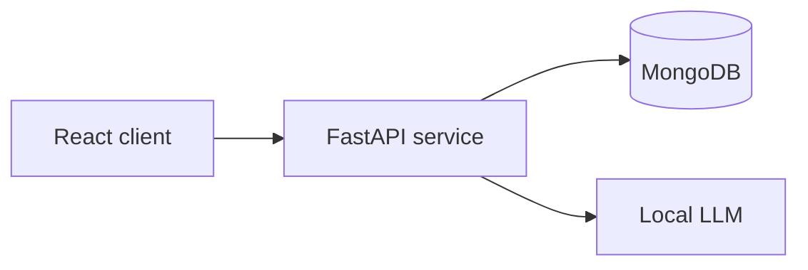

# Full-Stack LLM Chat

A learning-oriented full-stack application for exploring local LLM inference, conversational state, and AI product architecture. The project combines a FastAPI service, MongoDB persistence, a TypeScript/React interface, and a Hugging Face LLaMA-family model.

The goal is to develop a technically grounded application that connects lessons from NLP coursework, production AI experience, retrieval-augmented generation, and multi-agent systems—without reproducing proprietary code from previous work.

## Current capabilities

- [x] FastAPI backend
- [x] MongoDB-backed users and chat history
- [x] Hugging Face transformer model integration
- [x] Conversation context across messages
- [x] React Router and TypeScript frontend
- [x] User and chat retrieval endpoints
- [x] Environment-based database and model configuration

## Current architecture



### Backend

- Python and FastAPI
- MongoDB persistence
- Hugging Face Transformers
- User and conversation-history routes

### Frontend

- React Router v7
- TypeScript
- Tailwind CSS
- User selection and conversational interface

## API

| Method | Endpoint | Purpose |
|---|---|---|
| `GET` | `/users/` | List users |
| `GET` | `/users/{id}` | Retrieve one user |
| `GET` | `/users/{id}/chats` | Retrieve a user's chats |
| `GET` | `/chats/{id}` | Retrieve one chat |
| `POST` | `/chats/{id}/answer` | Add a message and generate a response |

## Setup

### Backend

```bash
cd backend
python -m venv .venv
source .venv/bin/activate
pip install -r requirements.txt
```

Create `backend/.env`:

```env
MONGO_URI=mongodb://localhost:27017/
MONGO_DB_NAME=kbt
MODEL_NAME=meta-llama/Llama-3.2-1B
```

Run:

```bash
uvicorn main:app --reload --host 0.0.0.0 --port 8000
```

### Frontend

```bash
cd frontend
npm install
npm run dev
```

Set `BACKEND_URL=http://localhost:8000` in `frontend/.env`.

## Engineering roadmap

These items are planned, not currently implemented.

### Reliability and testing

- [ ] Backend unit and integration tests
- [ ] Frontend component tests
- [ ] Request validation and consistent error responses
- [ ] Health/readiness endpoints
- [ ] Structured application logging

### Production-style LLM serving

- [ ] Server-Sent Events token streaming
- [ ] Accurate input/output token accounting
- [ ] Latency and time-to-first-token instrumentation
- [ ] Generation cancellation and timeout handling
- [ ] Model selection and configuration validation
- [ ] Rate limiting and request concurrency controls

### Security and deployment

- [ ] Authentication and authorization
- [ ] Secret-management documentation
- [ ] Docker Compose for frontend, backend, and MongoDB
- [ ] CI for tests and linting
- [ ] Deployment guide

### RAG and multi-agent learning

- [ ] Document ingestion and citation-grounded answers
- [ ] Integrate XRAG through a service boundary instead of duplicating its retrieval framework
- [ ] Add retrieval and answer-quality evaluation
- [ ] Experiment with corrective RAG as an evaluated XRAG strategy
- [ ] Add a small multi-agent workflow with explicit roles, shared state, and traceable handoffs
- [ ] Compare the multi-agent workflow against a single-agent baseline

## Scope

This repository is intentionally an educational product prototype. Retrieval experiments and benchmark methodology belong in the separate XRAG evaluation framework; this application focuses on the service boundary, conversational UX, persistence, streaming, observability, and deployment concerns.

## Project structure

```text
backend/
  config/
    db.py
    model.py
  routes/
    users.py
    chats.py
  main.py
frontend/
  app/
    components/
    routes/
    types.tsx
```

## License

A license has not yet been selected. Do not assume permission to redistribute this project until a license is added.
